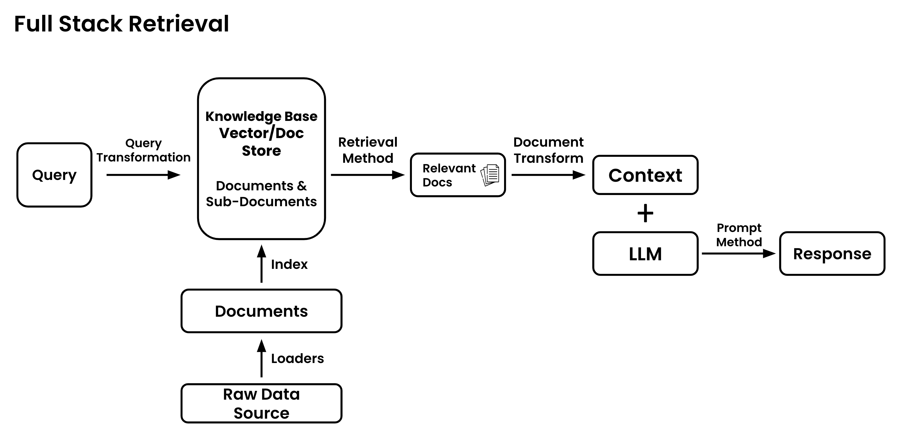

# HamiltonBot

This is the repository for the HamiltonBot app. It is a `streamlit` app that utilizes `langchain` and `chromadb` to create a chat-with-pdf/docx-app via OpenAI's GPT series of models. This is fairly standard RAG QnA app. If you want to see just the RAG code, see `RAG-implementation.ipynb`.

## Running the App

You will need to install `python>=3.1.1` and `virtualenv`.

```sh
git clone https://github.com/DarkHawk727/HamiltonBot
cd HamiltonBot
python -m virtualenv venv
.\venv\Scripts\activate
pip install -r requirements.txt
streamlit run app.py
```

## Architecture Diagram 
> Credits: Greg Kamradt from [fullstackretrieval](https://fullstackretrieval.com/)



The notebook is intended for both myself in the future, employers who just want to see the RAG code, and any future interns who want just the core functionality to improve upon. I opted to use the following packages for this project:
- `langchain`: I like the simplicity and elegance the abstractions provide. Our application is also not super niche so it would save reinventing the wheel in a lot of cases.
- `langchain_openai`: As of writing this (January 2024), OpenAI has the current best models; There is also a partnership between Microsoft and OpenAI. This is important because we currently have the microsoft suite and must use models from them.
- `chromadb`: Chroma lets me have a local vectorstore for storing the embeddings, which simplifies a lot of the security and drives down the cost.
- `unstructured`: Given that the RFPs are fairly complex documents with tables and images, I would need a way to parse them into html and base64 formats to feed into the LLMs. (Check issues of tenancy, they say that they don't store, if it's not allowed, try the Hosted SaaS API)

## Query Transformation

As you may know, the first step of any RAG pipeline is to transform the query. This should be done so that the quality and relevance of the documents retrieved can be better. There are a couple techniques for this:
1. Rewrite-Retrive-Read: Tell an LLM to try and improve the query by rephrasing it.
2. Multi-Query: Have an LLM generate 2-3 queries that ask the same thing different ways.
3. Step-back Prompting: Have the LLM to ask some "more basic" questions such as asking what principles are being used in the question.
4. RAG-Fusion: ???

I have currently selected Multi-Query as the Query Transformation. I believe this balances the cost with performance, where Rewrite-Retrieve-Read would be too simple and Step-back Prompting would be too expensive and slow.

>ℹ️ The questions that are going to be used to query the vectorstore are not going to be accessible as regular strings, instead they are logs so some code will be required should you want to get the questions as strings.

[Article on Query Transformations on the Langchain Blog](https://blog.langchain.dev/query-transformations/).

## Document Loaders

Since the eventual usecase for this system will be QnA with large (200+ page) documents, it's important to chunk them up into more manageable chunks. I would like to experiment (use a different prebuilt function) with Semantic Splitting. Semantic Splitting works by going through the document text 3 consecutive sentences at a time. If the embeddings of two groups of sentences are similar, it will merge both groups into a single chunk. This way it groups sentences with similar semantic content.

[](https://www.youtube.com/watch?v=8OJC21T2SL4?si=4s4VROINPiQOWUMh)

## Retrieval Method

When getting documents from the vectorstore that relate to a certain query, there are a couple options on how to select them.
1. The naive approach is the find the return the $k$ most similar embeddings of the documents to the query. This is fine, but for more complex documents (like RFPs), it can be helpful to maximize diversity of the documents.
2. Maximal-Marginal Relevance (MMR): This works by finding the embeddings with the greatest cosine similarity to the query but also penalizing them for similarity to already selected documents.

Given the nature of RFPs, I will be choosing to use MMR (It's just an option that you can choose from in the `.as_retriever()` method) as it performs better on more complex queries.

[Langchain Docs for Selecting Documents with MMR](https://python.langchain.com/docs/modules/model_io/prompts/example_selector_types/mmr)

## Useful Links:

 - [Langchain Documentation for Unstructured](https://python.langchain.com/docs/integrations/document_loaders/unstructured_file)
 - [Langchain Documentation for UnstructuredAPIIOFileLoader](https://api.python.langchain.com/en/stable/document_loaders/langchain_community.document_loaders.unstructured.UnstructuredAPIFileIOLoader.html#langchain_community.document_loaders.unstructured.UnstructuredAPIFileIOLoader)
 - [Link on RAG](https://medium.com/@onkarmishra/using-langchain-for-question-answering-on-own-data-3af0a82789ed)
 - [Deploy a streamlit app](https://ploomber.io/blog/streamlit_exe/)
 
